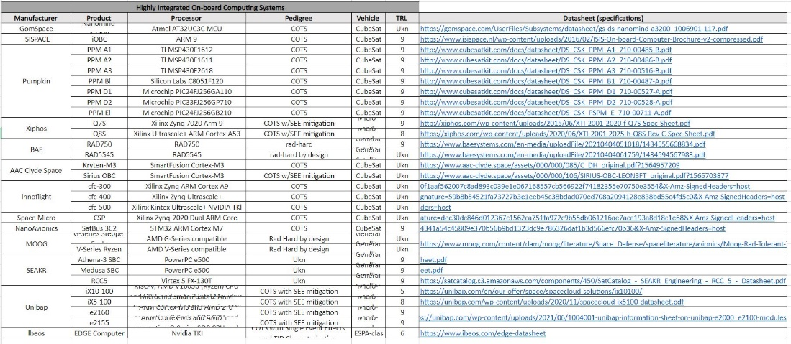

.. _`cdh_system`:

Command & Data Handling System
========================================

Due to the lack of time, this subsystem, together with the ADCS one (:ref:`adcs_system`), are not fully developed. However,
on the Excel sheet there is a collection of all the possible highly integrated on-board computer systems, among which the
user can choose and design its own.

For each of them, the TRL is indicated, together with the type of vehicle on which they can mostly be found, and other
useful information that can be seen in the above picture.

