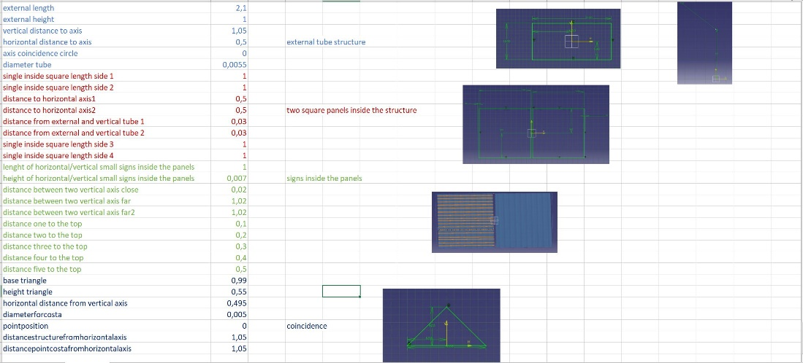
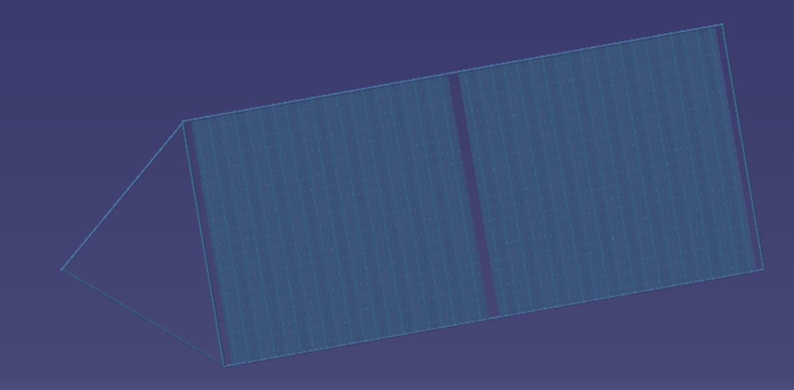

.. _`eps_system`:

Electrical Power System
========================================

The EPS system is designed around a maximum power draw, where the required solar panel characteristics are computed.
Therefore, the power consumption of specific payload/subsystems is needed as well as the different operational groups
for the power scheduling. Once the maximum power draw has been defined through the power schedule, this parameter is
used to size the solar arrays. Additionally, the battery charge required is calculated on cell B44 which needs to be
re-inputted into B13 due to circular Excel calculation issues. This only needs to be done twice until the difference
between the values is minimal.

A significant amount of data needed to size the solar arrays is extracted from Tudat(Py) and is therefore linked to the
``Tudat data`` sheet so any modification of these parameters will lead to a change in the solar panel power generation.
Overall, the main output of the EPS are the mass and size of the batteries and solar arrays.

CATIA Integration
---------------------------

When modelling the satellite’s EPS, one of the most important parameters is given by the area of the solar panel. This
value comes out of the electrical budget, once it is known how much power is needed. The area of the solar panel, will,
indeed change, depending on it. For this reason, when doing a CAD model, it is important to design that accordingly.
However, the rest of the design and the entire structure of the solar panel remains the same. Therefore, a predesign of
a solar panel is already made. An Excel sheet is written with all the parameters and values assigned, which were used to
design the general structure of the panel. By changing one of the parameters, the model on CATIA will change accordingly.
In order to see the variation, once a different value is assigned on the Excel sheet, the file must be saved and on the
CAD model, the sketch must be re-opened and re-closed. By having both the Excel and the CATIA model open, relations can
be very fast noticed.

On the Excel sheet the different parameters are named in accordance with what they stand for, and specific screenshots
are put next to them so to make it clear to which length they refer to. The sheet looks, more or less, like this:

The Solar Panel structure, instead, looks like this:

Anyways, it is important to notice that, when a parameter is changed, the others are not linked and thus, it will be
necessary to change them to in order to have, again, a shape like the original one in the previous picture, e.g., if the
length of the main structure changes, then also the length of the inside squares will have to be changed. This can be
easily noticed once one starts modelling and designing the panel.

A pre-made solar panel was interesting to do since, not only it was an interesting example to use, in order to show the
integration of Excel to Catia, but also because, having to change only the area of the panels, a pre-made model can make
the design process way simpler and quicker.

Finally, as it can be noticed from the picture as well, the solar panel presents some horizontal stripes. Those ones are
modelled in order to make the design even more realistic. Anyways they are not implemented on the Excel sheet and thus,
if they are liked and wanted on the model too, once the area of the solar panel is known, their dimensions will also have
to be changed and modelled directly on CATIA.

