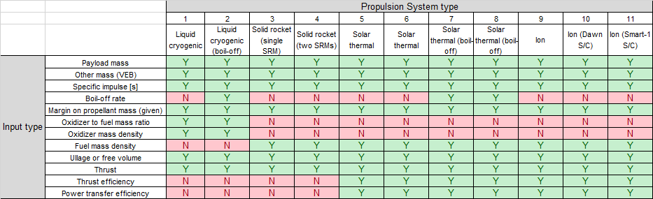
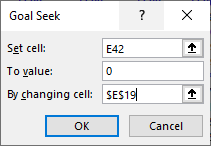

.. _`propulsion_system`:

Propulsion System
========================================

There are several types of propulsion systems which have already been embedded into the CDP4 template for your convenience.
These include liquid cryogenic (with and w/out boil-off), solid rocket (single and double SRM), solar thermal (with and
w/out boil-off), and ion propulsion. These types are numbered 1-11 as shown below. This number is a variable that can be
set in CDP4 under the ``Propulsion Subsystem``, named ``prop_sys_type``.  Different inputs are required for the different
propulsion system types; therefore, for your convenience the figure below describes which inputs are required for which
propulsion type.

If you wish to add a different propulsion type, you may do so by adding an additional column to the spreadsheet with the
relevant parameters. If you choose to do so, you must add a number above the name of your propulsion system and fill
that in for the ``prop_sys_type`` variable.

The main outputs for the propulsion subsystem are the propellant and propulsion system masses; with additional
secondary outputs comprising dry vehicle mass, oxidizer mass, fuel mass, propellant density, propellant volume, Total v
olume of motor case or tank, mass flow rate and total thrust time. All of these variables, and more can be found in the
appropriate tab of the master spreadsheet. Once the relevant inputs have been set by the user, cell 42 for the propulsion
type selected will no longer equal zero. This cell is used to iteratively find a solution for the propellant mass. In
order to obtain the correct value for propellant mass a ``Goal seek What-If`` analysis must be conducted in Excel as shown
in the figure below, by modifying cell 19 of the selected propulsion type.

