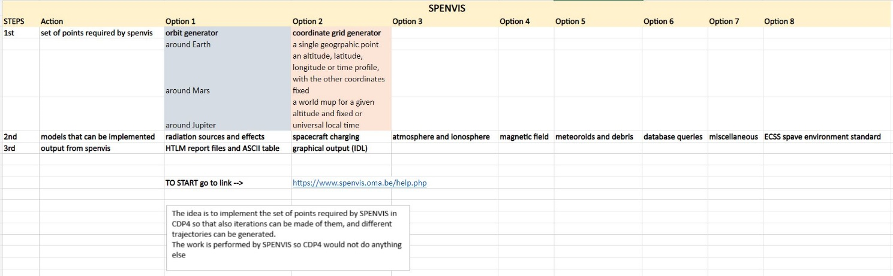

.. _`radiation_system`:

Radiation System
========================================

The radiation subsystem is usually something not taken very much into account since part of it is treated in the thermal,
propulsion, structure, etc. However, when doing the design of a mission, a specific tool can be used, in order to model
the space environment and its effects due to radiation. Through this tool, depending on the model that needs to be
implemented the following can be chosen:

*	Radiation sources and effects

*	Spacecraft charging

*	Magnetic field

*	Atmosphere and ionosphere

*	Meteorides and debris

*	Miscellaneous

It helps the user to do a rapid analysis of the trajectory taken into account and the space environment related problems.
The output can be done put into some graphics, plots, tables or anything that is preferred, on Excel.

The idea is to implement the set of points required by SPENVIS in CDP4 so that also iterations can be made on them, and
different trajectories can be generated.

The work is performed by SPENVIS so CDP4 would not do anything else. Therefore, it is understandable that this tool can
be used in case a much more accurate design is required. For simple mission designs, it can be neglected.
