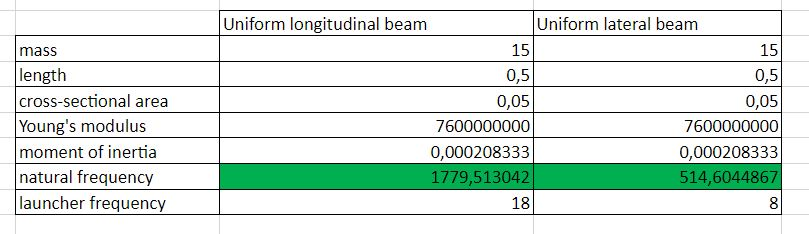
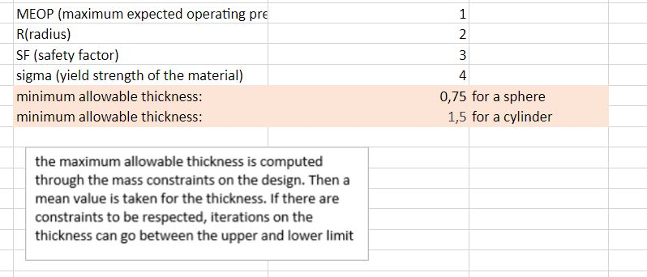

.. _`structure`:

Structure (with CATIA connection)
========================================

On CDP4 this subsystem will show all the most important parameters, necessary to come up with a valid and solid structure
for the satellite. All the dimensions are connected to an Excel spreadsheet. This one is, again, connected to CATIA V5,
in such a way that if, for example, one dimension of the structure changes, the CATIA model will change too, accordingly.

An important thing to notice is that, if changes on the dimensions of the satellite are done by other people (not by the
one who models on CATIA), then the CATIA user must open the Excel sheet, reclose it and then open CATIA in order to see
the changes there too. Otherwise, variations can be directly done by the CATIA user, as long as the changes are performed
on the Excel sheet and then the latter is closed before opening the CATIA model.
y
The structure presented on the CATIA model is a basic CubeSat one, which is usually used to design many missions, nowadays.
For now, only the basic parameters are connected, such as the length, width, height and thicknesses, but, later, as it can
be seen on CDP4, more parameters will be added and will influence the design.

On the Excel spreadsheet created by the TA, a table referring different options of materials can be found. The materials
considered are of Additive Manufacturing family so Accura Bluestone and Windform XT2.0 and Aluminium Alloys such as the
6061, 7075, 5005, and 5052. For each material some properties are listed such as the density (in gr/cm^3), the colour,
the melting point (in °C), the tensile strength (in MPa), the glass transition (Tg), the tensile modulus (in MPa),
the surface resistivity (in Ohm), the flexural strength (in MPa), the Technological Readiness Level (TRL) in LEO and the outgassing TML. Moreover, for
the most important parameters (thickness, launcher loads, and natural frequency) that need to be designed for this subsystem
there are different formula and equations. Before the use, random numbers can be noticed for the parameters, but once
the appropriate ones (depending on the design) are inserted, values for both thickness and the frequency come in the
outcome:

Regarding the loads, the Excel sheet needs to be consulted preferably, since more information is given, depending on the
launcher used and its design (factors).