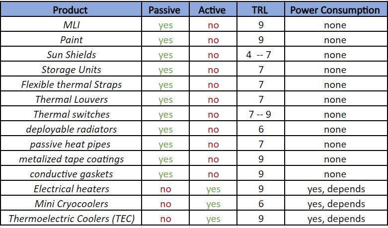

.. _`thermal_system`:

Thermal System
========================================

The thermal management system mostly consists of passive and active systems that are needed to cool down or heat up the
system depending on the power assumptions coming from the EPS. On the Excel sheet there is a table that summarizes the
most used systems, both active and passive.

For each of them an indication of the TRL is given, and on the power consumption. In this way then many iterations can
be done on CDP4 according to the power needed or available from the rest of the subsystems.

It is also indicated the thermal temperature that a specific component can withstand.

This can help in the choice of the thermal subsystem.

At this point, in order to design the subsystem, the following parameters that are needed are summarized in a table on the
Excel sheet:

The four parameters in the middle: absorptivity, incidence angle, absorption area/radiating area ratio and emissivity are
implemented in CDP4 since they are manual values to give as input. At that point, together with the solar flux obtained
by the EPS subsystem, the equilibrium temperature can be computed and iterations can start on CDP4, according to the
table where the maximum temperatures that every component can withstand says.

With this scheme, to design the subsystem it will be needed very few minutes, since everything is already inserted. The
only thing that will change is the solar flux, depending on the orbit of the mission, and thus the equilibrium temperature.
Nothing else is needed to be changed.

