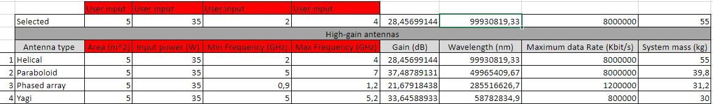
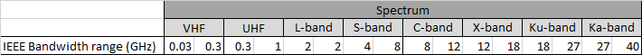

.. _`ttc_system`:

Telemetry, Tracking and Command System
========================================

On CDP4 this subsystem will be composed of 9 different parameters, which are:

*   Antenna gain (dB)

*	Antenna area (m^2)

*	Antenna type

*	Maximum data rate (kbps)

*	Input Power (W)

*	Minimum and Maximum frequency (Hz)

*	Wavelength (nm)

*	Mass of the System (kg)

Among these ones, the area, the input power, and the minimum and maximum frequency are user inputs, and they come once
the user has selected the type of antenna that is needed, based on the mission profile. In order to do so, an EXCEL
sheet file is implemented.

Regarding the ground segment, a list of usable infrastructure for deep-space communications has been included in the
Excel sheet, together with their key parameters. Using a combination of these and the different antenna performances,
it is recommended that you find the communication bands your spacecraft may be employing, as shown below.

Once the system is decided, according to the previous table, the input parameters are defined, and the TT&C subsystem
will be finalised since the gain, frequencies and wavelength will come automatically.