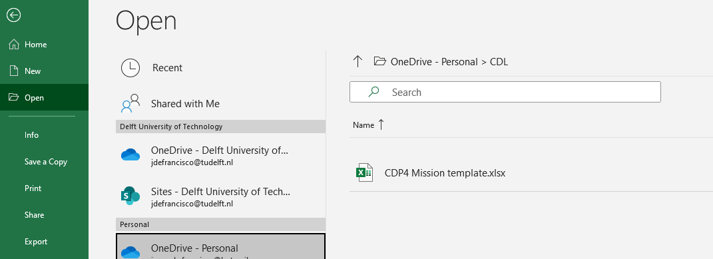
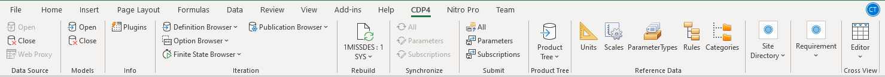

.. _`cdp4`:

CDP4 Excel Template User Manual
===================================

In order to further enable the design process of a spacecraft mission, a set of tools have been developed for you (as
the user) in the form of a CDP4 template embedded with Microsoft Excel which also connects with Tudat(Py) scripts.
This manual is split into different chapters, relating to the general mission and the subsystems which make up a spacecraft.

It is important to note that within the CDP4 environment, variables set as ``MANUAL`` are for the user to input, while
variables under the ``COMPUTED`` description are obtained from the calculations on either the Excel sheet or Tudat(Py).
In order to access the master Excel sheet, the CDP4 addon for Excel is required, which you will use to login and rebuild
the Excel template. The Excel Template can be found in :ref:`downloads`.

The excel template consists of a collection of sheets with the different functionalities for the main engineering roles
and their respective subsystems. The level of detail of these sheets is not consistent across the board, and it is your
job as the user to expand and modify these sheets to capture important aspects of your subsystems. Additionally, it is
expected of you to review the formulas and values presented throughout the sheets, as any parameters or methods used in
the design of your spacecraft are ultimately your responsibility. You are welcome to use all, some, or none of the sheets
in the template on your final design.

Online Excel collaboration
-----------------------------------

While CDP4 enables online collaboration, when working with the excel template you will most likely want to be working
simultaneously on different subsystems. We have found that the best way to do this, while still maintaining full Excel
functionality is for one of your group members to host this file on Microsoft OneDrive and share it with all group members
either on your TU Delft account or a personal account. Then, after linking your OneDrive account to your Excel all group
members may simultaneously open the file locally as shown in the figure below. An alternative is to use the online version
of Excel through OneDrive if you cannot link your account to your local Excel program. However, then you will be missing
all plugin functionalities from CDP4 and therefore will not be able to submit changes or rebuild the model.

Excel file
----------------------------------------

The Excel Template can be found in :ref:`downloads`. Once Microsoft Excel has the CDP4 plugin installed, you may publish
changes in parameters to, and from, CDP4. The template Excel file is split into sheets with different functionalities.
While most of the sheets are used for a specific subsystem, the first two sheets are specifically used for CDP4
interactions, with the ``Parameters`` sheet being the main focus. The Excel file computes many values for a set of inputs,
these parameters are embedded into CDP4 and the ``Parameters`` sheet as ``COMPUTED`` and ``MANUAL`` respectively.
``COMPUTED`` parameters are calculated in their respective spreadsheet and are linked back to CDP4, ``MANUAL`` parameters
on the other hand are input to these spreadsheets. Therefore, if you change a ``MANUAL`` parameter, you should see your
changes reflected in several ``COMPUTED`` parameters.

To sync changes from CDP4, or to add the CDP4 parameters to a new spreadsheet, you must connect to the relevant server
using the CDP4 Excel plugin and open your model. Then you can ``Rebuild`` your model with the relevant button press under
the CDP4 Excel plugin tab.

To sync changes to CDP4 from the Excel sheet, you may upload your changes to your CDP4 account, where you will have to
publish them later. You may upload you changes by pressing ``Submit all`` under the CDP4 Excel plugin tab. Then, if you
refresh CDP4 you should see those changes highlighted in blue, which you can then publish to finalize them.

How to implement CATIA and Excel
--------------------------------------

In order to connect CATIA and Excel, in such a way that, from a data sheet in Excel, dimensions of the model on CATIA
change, some steps need to be taken:

*   Change the settings on CATIA by going in ``Tools``, then ``Options``, ``Infrastructure``, ``Part Infrastructure``, ``Display`` and then click on both ``parameters`` and ``relations``. Then stay in the ``options`` window and go to ``Analysis and Simulation``, ``General``, and then show ``relations and parameters``. Save the changes and close the window.

*	Create an Excel file with all the necessary parameters in the first column. Pay attention not to leave any empty row between the parameters. Give the parameters the unit of measure of the meters. In this way it will be correctly translated into mm in CATIA

*	First do a sketch, and then give it all the necessary constraints. Then create a design table, from an existent file. Choose the Excel one, pre-made, and select the page of the sheet at which the interested parameters are. Usually, put the horizontal layout for the table.

*	At this point the relation between the constraints on CATIA and the parameters on Excel can be made.

*	Close and re-open the sketch on CATIA in order to be able to see the changes. An update symbol will appear on the page

Sometimes it can happen that for any new relation to create, a new design table must be made. Other (if any) necessary
steps are indicated in the following paragraphs, for the specific designs of the Structure and EPS subsystems.

Subsystems
----------------

The various subsystems that can be designed using the Excel template are described in the following sections.

.. toctree::
   :maxdepth: 1

   _subsystems/propulsion_system
   _subsystems/ttc_system
   _subsystems/structure
   _subsystems/eps_system
   _subsystems/thermal_system
   _subsystems/cdh_system
   _subsystems/adcs_system
   _subsystems/radiation_system

Requirements
----------------------

As far as it is now, requirements cannot be implemented on CDP4. Whenever a requirement is inserted, it does not show
any indication on whether it is verified or something need to be changed. Therefore, what is recommended for now is to
start from the general requirements written on the Excel sheet, define and ultimate them, and at that point iterating
(manually) between the results given on CDP4 and the values written on the Excel sheet.