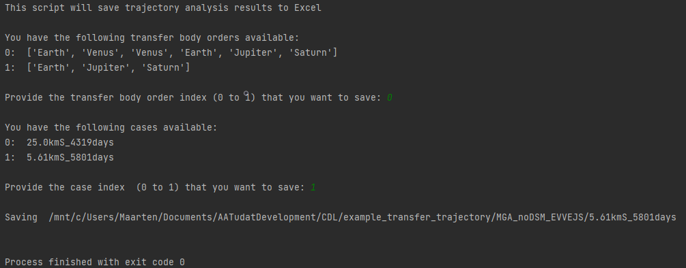

.. _`mga_dsm_save_to_excel`:

MGA-DSM save results to Excel
========================================

The results from the MGA-DSM transfer trajectory analyses should be used to design a spacecraft in CDP4 that can
actually fly the mission. To do so, one needs to write the results of one trajectory to Excel. This is done with
``transfer_trajectory/transfer_trajectory_save_to_excel.py``. As this script executes, some inputs are requested from
the  user to define the case of which the results are to be saved, similar to selecting the cases that were to be
analysed further after the optimization. The script requests the transfer body order, then searches what cases are
present and then requests which of these is to be saved. The procedure is depicted below.

